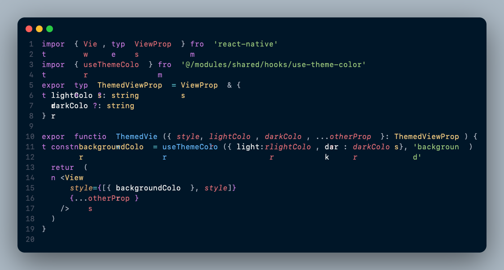
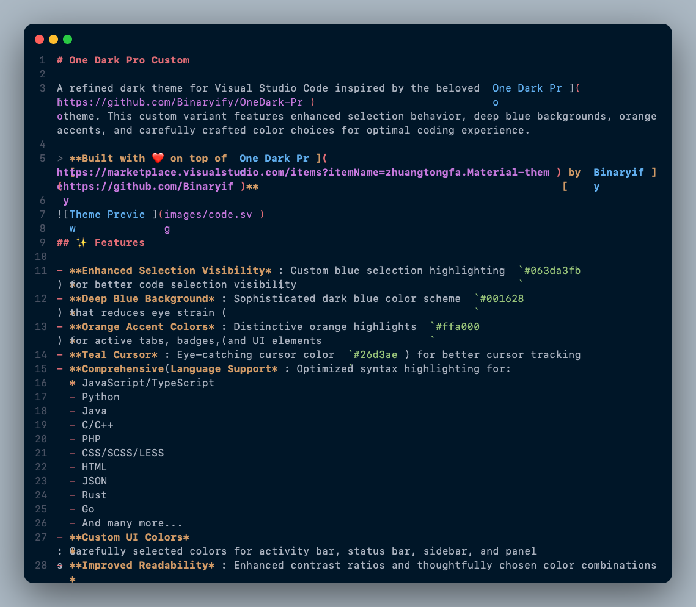

# One Dark Pro Custom

A refined dark theme for Visual Studio Code inspired by the beloved [One Dark Pro](https://github.com/Binaryify/OneDark-Pro) theme. This custom variant features enhanced selection behavior, deep blue backgrounds, orange accents, and carefully crafted color choices for optimal coding experience.

> **Built with ❤️ on top of [One Dark Pro](https://marketplace.visualstudio.com/items?itemName=zhuangtongfa.Material-theme) by [Binaryify](https://github.com/Binaryify)**



## ✨ Features

- **Enhanced Selection Visibility**: Custom blue selection highlighting (`#063da3fb`) for better code selection visibility
- **Deep Blue Background**: Sophisticated dark blue color scheme (`#001628`) that reduces eye strain
- **Orange Accent Colors**: Distinctive orange highlights (`#ffa000`) for active tabs, badges, and UI elements
- **Teal Cursor**: Eye-catching cursor color (`#26d3ae`) for better cursor tracking
- **Comprehensive Language Support**: Optimized syntax highlighting for:
  - JavaScript/TypeScript
  - Python
  - Java
  - C/C++
  - PHP
  - CSS/SCSS/LESS
  - HTML
  - JSON
  - Rust
  - Go
  - And many more...
- **Custom UI Colors**: Carefully selected colors for activity bar, status bar, sidebar, and panels
- **Improved Readability**: Enhanced contrast ratios and thoughtfully chosen color combinations

## 🚀 Installation

### From VS Code Marketplace

1. Open Visual Studio Code
2. Press `Ctrl+Shift+X` (Windows/Linux) or `Cmd+Shift+X` (macOS) to open Extensions view
3. Search for "One Dark Pro Custom"
4. Click "Install"
5. Press `Ctrl+K Ctrl+T` (Windows/Linux) or `Cmd+K Cmd+T` (macOS) to open theme selector
6. Select "One Dark Pro Custom"

### Manual Installation

1. Download the `.vsix` file from the [releases page](https://github.com/theodrosyimer/one-dark-pro-custom/releases)
2. Open VS Code and run `Extensions: Install from VSIX...` command
3. Select the downloaded `.vsix` file
4. Activate the theme via `Preferences: Color Theme`

## 🎨 Theme Showcase

### Code Editing


### Markdown



<!-- ### UI Elements

 -->

## ⚙️ Configuration

This theme works out of the box without additional configuration. However, you can customize it further:

### Font Recommendations

For the best experience, consider using these fonts:

- [Fira Code](https://github.com/tonsky/FiraCode)
- [JetBrains Mono](https://www.jetbrains.com/lp/mono/)
- [Cascadia Code](https://github.com/microsoft/cascadia-code)

### Custom Overrides

Add these to your `settings.json` to customize further:

```json
{
  "workbench.colorCustomizations": {
    "[One Dark Pro Custom]": {
      "editor.background": "#001628",
      "editor.selectionBackground": "#063da3fb"
    }
  },
  "editor.tokenColorCustomizations": {
    "[One Dark Pro Custom]": {
      "comments": "#7f848e"
    }
  }
}
```

## 🎯 Key Customizations

This theme specifically modifies:

- **Selection Colors**: Enhanced visibility with custom blue selection background
- **Editor Background**: Deep blue-black (`#001628`) for reduced eye strain
- **Active Elements**: Orange accents (`#ffa000`) for tabs, badges, and highlights
- **Cursor**: Distinctive teal color (`#26d3ae`) for better visibility
- **Syntax Highlighting**: Language-specific optimizations for better code readability

## 🔧 Development

### Building from Source

```bash
git clone https://github.com/theodrosyimer/one-dark-pro-custom.git
cd one-dark-pro-custom
pnpm install
pnpm run package
```

### Automated Releases

This project uses automated releases via GitHub Actions and `release-it`:

```bash
# Test release locally (dry run)
pnpm run release:dry

# Create release locally
pnpm run release

# Fully automated releases via GitHub Actions:
# - feat: commits → minor version bump + release
# - fix: commits → patch version bump + release
# - feat!: or BREAKING CHANGE → major version bump + release
```

### Contributing

Contributions are welcome! Please feel free to submit a Pull Request.

## 📊 Compatibility

- **VS Code Version**: 1.34.0 or higher
- **Platform**: Windows, macOS, Linux
- **Languages**: All languages supported by VS Code

## 🐛 Known Issues

- None currently reported

## 🙏 Acknowledgments

- **Built upon**: [One Dark Pro](https://github.com/Binaryify/OneDark-Pro) by [Binaryify](https://github.com/Binaryify) - Thank you for creating such an amazing foundation!
- **Original inspiration**: Atom's One Dark theme
- **Community**: VS Code theming community for continuous inspiration
- **Special thanks**: All One Dark Pro users who helped shape the original theme

This theme wouldn't exist without the incredible work of Binaryify on the original One Dark Pro. While this custom version has evolved significantly with unique color choices and behaviors, it maintains the spirit and quality of the original.

## 📞 Support

If you encounter any issues or have suggestions:

- Create an issue on [GitHub](https://github.com/theodrosyimer/one-dark-pro-custom/issues)
- Rate and review on the [VS Code Marketplace](https://marketplace.visualstudio.com/items?itemName=TheodrosYimer.one-dark-pro-custom)

## 📄 License

This project is licensed under the MIT License - see the [LICENSE](LICENSE) file for details.

---

**Enjoy coding with One Dark Pro Custom!** 🎨✨
